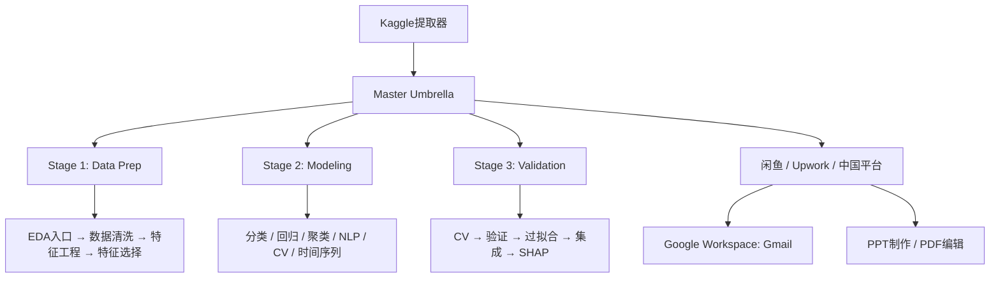

# Hermes Skills Knowledge Graph

Welcome to the Hermes Skill Logic Map. Each node is a skill, each edge is a relationship.

## Core Workflow

## 🔬 Core: Data Science & ML (30 skills)

→ [[data-science]]

Pipeline chain: [[Kaggle提取器]] → [[Master Umbrella]]  
Data prep: [[EDA入口]] → [[数据清洗]] → [[特征工程]] → [[特征选择]]  
Modeling: [[分类建模]] / [[回归建模]] / [[聚类分群]] / [[NLP文本]] / [[时间序列]]  
Validation: [[交叉验证]] → [[模型验证]] → [[高级集成]] → [[SHAP解释]]  

## 💼 Business & Productivity

→ [[productivity]] (9) | [[email]] (1) | [[github]] (6)

Key chain: [[中国自由职业平台]] ↔ [[闲鱼数据分析服务]]  
Delivery: [[Google Workspace]] | [[PPT制作]] | [[PDF编辑]]  

## ⚙️ MLOps & AI Engineering

→ [[mlops]] (21) | [[autonomous-ai-agents]] (4)

Fine-tuning: [[Axolotl微调]] / [[TRL微调]] / [[PEFT微调]] / [[Unsloth]]  
Inference: [[vLLM推理]] / [[llama.cpp]] / [[GGUF量化]]  
Agents: [[Claude Code]] / [[OpenAI Codex]] / [[OpenCode]]  

## 🛠️ Development

→ [[software-development]] (11) | [[devops]] (3) | [[mcp]] (2)

Workflow: [[计划模式]] → [[编写计划]] → [[子代理开发]]  

## 🎨 Creative & Media

→ [[creative]] (19) | [[media]] (5) | [[social-media]] (2)

## 📚 Knowledge & System

→ [[note-taking]] (1) | [[research]] (5) | [[apple]] (4)  
→ [[gaming]] (2) | [[leisure]] (1) | [[smart-home]] (1)  
→ [[red-teaming]] (1) | [[dogfood]] (1) | [[yuanbao]] (1)

---

## Key Relationship Chains

1. **Kaggle → Data Science → Freelancing**  
   [[Kaggle提取器]] → [[Master Umbrella]] → [[闲鱼数据分析服务]] / [[中国自由职业平台]]

2. **Data Prep Pipeline**  
   [[EDA入口]] → [[数据清洗]] → [[特征工程]] → [[特征选择]]

3. **Email Setup**  
   [[Google Workspace]] (Gmail API, 当前使用) ↔ [[Himalaya CLI]] (IMAP/SMTP备选)

4. **Dev → Deploy**  
   [[计划模式]] → [[编写计划]] → [[子代理开发]] → [[GitHub认证]] → [[PR工作流]]

5. **Supply Chain Domain**  
   [[供应链分析]] — 基于Unilever真实数据，仓库库存周转率分析

---

*Open Graph View (Cmd+G) to see the full knowledge network. Drag nodes to explore relationships.*
